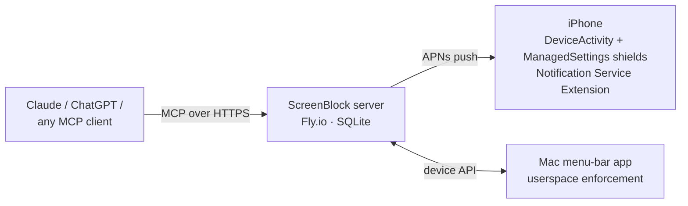
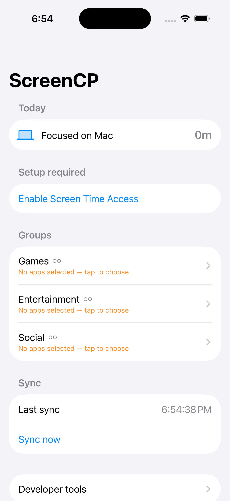
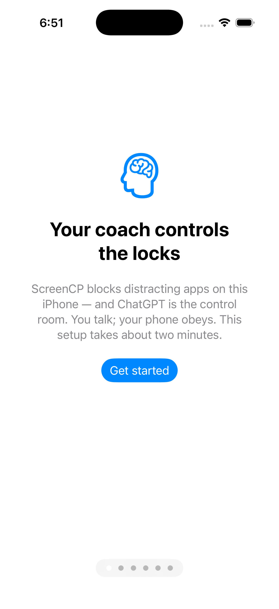

# ScreenBlock MCP

[](https://github.com/vishk23/screenblock-mcp/actions/workflows/ci.yml)
[](LICENSE)


**Block and unblock apps on your iPhone and Mac from Claude, ChatGPT, or any
MCP client.** Real Apple Screen Time enforcement — schedules, daily limits,
temporary grants, earned time — driven entirely by chat.

Every screen-time MCP server on GitHub *reads* your usage data. ScreenBlock
*enforces*: the AI you already talk to all day holds the keys to your app
blocks, and asking it for time back is the interface.

## What it feels like

> **You:** give me 10 minutes of snapchat
>
> **Claude:** *(calls `grant_temp_access`)* Done — Snapchat is open until
> 3:42 pm. The shield comes back automatically. You've used 2 of your 3
> unlocks today.
>
> **You:** actually block everything, I need to write
>
> **Claude:** *(calls `block_now` on every group)* Locked: Social,
> Entertainment, News. Say the word when you're done and I'll lift it.

The grant expires server-side and a push notification re-shields the app —
no honor system, no "just five more minutes" drift.

## How it works



- **Server** (`server/`): TypeScript MCP server exposing 14 tools, backed by
  SQLite on a Fly volume. Auth is a bearer secret in the MCP URL path.
- **iPhone** (`ios/`): SwiftUI app + 5 extensions. Shields are applied by
  Apple's ManagedSettings; pushes (including a Notification Service Extension
  that can apply shields with the app force-quit) keep the device in sync.
- **Mac** (`mac/`): menu-bar companion registered as a second device on the
  same groups — tracks real per-app minutes and enforces by terminating
  blocked apps.

**Privacy by design:** the server never knows which apps are in a group.
Apple's FamilyControls tokens are opaque; only you, on your phone, can see or
edit a group's contents. The AI operates on group names alone.

## Tools

| Tool | What it does |
|---|---|
| `get_status` | Current blocking status across all groups |
| `list_groups` | List app groups |
| `create_group` | Create an empty named group (you pick its apps on-device) |
| `set_schedule` | Recurring block schedule (supports overnight windows) |
| `set_limit` | Daily time limit for a group |
| `block_now` | Block a group immediately |
| `unblock` | Remove an active block |
| `grant_temp_access` | Temporary access that auto-expires and re-shields |
| `remove_policy` | Delete a schedule/limit policy |
| `set_group_mode` | Unlock mode per group: strict, quota, or open |
| `set_earn_rule` | Earned time: productive minutes convert to reward minutes |
| `set_goal` | Set today's goal for coaching context |
| `get_today_summary` | Today's adherence summary |
| `get_summary_range` | Multi-day adherence summary |

## Screenshots

<!-- screenshots: docs/assets/ -->
<p align="center">
  
  
</p>

*Shield + Live Activity shots require a real device — coming soon.*

## Self-hosting

You deploy your own instance; there is no shared service.

**1. Server → Fly.io**

```bash
cd server
cp .env.example .env        # fill in tokens (long random strings)
fly launch --no-deploy      # pick an app name; add a volume for SQLite:
fly volumes create data --size 1
fly secrets set MCP_BEARER_TOKEN=... DEVICE_BEARER_TOKEN=... SQLITE_PATH=/data/screenblock.db TIMEZONE=America/New_York
fly deploy --yes
```

**2. iPhone app** — requires a paid Apple Developer account (Family Controls
entitlement) and a real device (Screen Time APIs don't work in the simulator).

```bash
cd ios
xcodegen generate
# put your server URL + DEVICE_BEARER_TOKEN in ScreenCP/Sources/Secrets.swift
xcodebuild -project ScreenCP.xcodeproj -scheme ScreenCP \
  -destination 'platform=iOS,id=<your-device-udid>' -allowProvisioningUpdates build
```

**3. Connect your AI**

```bash
claude mcp add --transport http screenblock https://<your-app>.fly.dev/mcp/<MCP_BEARER_TOKEN>
```

For ChatGPT: add a custom connector with the same URL and enable "Allow all
actions". For APNs pushes (instant re-shielding), set the `APNS_*` secrets
from `.env.example`.

**4. Mac app (optional)** — `cd mac && xcodegen generate && xcodebuild build`,
then log in with the same server URL.

## Security model

- MCP auth: unguessable bearer secret in the URL path; device API uses a
  separate bearer token. Rotate either by updating Fly secrets.
- The server stores group *names*, policies, grants, and adherence events —
  never app identities, screenshots, or content.
- Timing-safe token comparison, rate-limited nudge endpoint, bounded APNs
  token storage.

## Platform notes

- **Why the Mac app doesn't use Screen Time:** Apple's FamilyControls /
  ManagedSettings APIs are marked unavailable on macOS and the entitlement is
  not granted for Mac targets (verified against the macOS 26 SDK). Every Mac
  blocker (Opal, Jomo, one sec) enforces in userspace; ScreenBlock does the
  same — frontmost-app tracking plus kill-on-launch, synced to the same
  groups as your phone.
- DeviceActivity schedules have a 15-minute minimum resolution; ScreenBlock's
  server-side grants + pushes work around Apple's coarse timers.

## License

[MIT](LICENSE)
