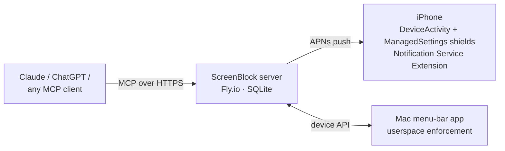

# ScreenBlock Rename + Repo Polish Implementation Plan

> **For agentic workers:** REQUIRED SUB-SKILL: Use superpowers:subagent-driven-development (recommended) or superpowers:executing-plans to implement this plan task-by-task. Steps use checkbox (`- [ ]`) syntax for tracking.

**Goal:** Rename ScreenCP → ScreenBlock MCP on all visible surfaces and publish a polished public repo `vishk23/screenblock-mcp` with a flagship README, MIT license, and CI.

**Architecture:** String-level rename only (Brand constants, MCP server metadata, user-visible copy); all identifiers/URLs that would break provisioning or deployed clients stay. Repo polish is additive files (README, LICENSE, CONTRIBUTING, CI workflow) plus removal of stray root artifacts. Publish happens after a full-history secret sweep.

**Tech Stack:** TypeScript/Node 24 (vitest), Swift/XcodeGen (iOS + Mac), Fly.io, GitHub Actions, gh CLI.

## Global Constraints

- Product name everywhere user/AI-visible: **ScreenBlock** (server advertised name: `screenblock`; repo: `screenblock-mcp`).
- DO NOT rename: bundle IDs (`…screencp…`), Xcode target/directory names (`ios/ScreenCP*`, `mac/ScreenCPMac`), Fly app `screencp` / `screencp.fly.dev` / volume `screencp_data`, and the push payload key `screencp: 'setup'` in `server/src/mcp.ts` (~line 190) + its assertion in `server/test/tools.test.ts:165` — the iOS AppDelegate routes deep links on that key.
- Repo owner: `vishk23`. License: MIT. Repo visibility: public (explicitly approved by VK in the design spec).
- GitHub description (exact): `Block and unblock apps on iPhone/Mac from Claude, ChatGPT, or any MCP client — Screen Time enforcement, temp grants, earned time.`
- Server tests must stay green: `cd server && npx vitest run`.
- CI must use Node 24+ (`node:sqlite` requires it).

---

### Task 1: Root cleanup

**Files:**
- Modify: `.gitignore`
- Delete (tracked): `node_modules/.package-lock.json`, `node_modules/.vite/vitest/da39a3ee5e6b4b0d3255bfef95601890afd80709/results.json`, `package-lock.json` (root only — NOT `server/package-lock.json`)

**Interfaces:**
- Produces: clean repo root; `node_modules/` ignored globally.

- [ ] **Step 1: Remove tracked junk**

```bash
git rm -r --cached node_modules
git rm package-lock.json
rm -rf node_modules package-lock.json
```

- [ ] **Step 2: Ignore node_modules**

Append to `.gitignore` (file currently ends with `scratch/`):

```
node_modules/
```

- [ ] **Step 3: Verify**

Run: `git status --short` — expect deletions + `.gitignore` modified, nothing else. `git ls-files | grep node_modules` → empty.

- [ ] **Step 4: Commit**

```bash
git add -A
git commit -m "chore: remove stray root node_modules artifacts and lockfile"
```

---

### Task 2: Server rename (code + tests)

**Files:**
- Modify: `server/src/mcp.ts`, `server/src/push.ts`, `server/src/deviceApi.ts`, `server/src/index.ts:17`, `server/package.json:2`, `server/test/tools.test.ts:64`

**Interfaces:**
- Produces: MCP advertised name `screenblock`; all instruction/note/push-title copy says "ScreenBlock". Task 5's README references tool titles unchanged.

- [ ] **Step 1: Update test expectation first (TDD)**

`server/test/tools.test.ts:64`: change

```ts
expect(r.json.note).toMatch(/open the ScreenCP iOS app/);
```

to

```ts
expect(r.json.note).toMatch(/open the ScreenBlock iOS app/);
```

Leave line 165 (`data?.screencp`) untouched — payload key is plumbing.

- [ ] **Step 2: Run tests, expect the one failure**

Run: `cd server && npx vitest run test/tools.test.ts` → FAIL on the note-text assertion only.

- [ ] **Step 3: Rename user-visible strings**

```bash
cd server
sed -i '' 's/ScreenCP/ScreenBlock/g' src/mcp.ts src/push.ts src/deviceApi.ts
sed -i '' "s/{ name: 'screencp'/{ name: 'screenblock'/" src/mcp.ts
sed -i '' 's/screencp server listening/screenblock server listening/' src/index.ts
sed -i '' 's/"name": "screencp-server"/"name": "screenblock-mcp-server"/' package.json
```

Case-sensitive sed leaves the lowercase `screencp: 'setup'` payload key intact — verify with `grep -n "screencp" src/mcp.ts` (expect ONLY the payload-key line).

- [ ] **Step 4: Full test run**

Run: `cd server && npx vitest run` → all green.

- [ ] **Step 5: Commit**

```bash
git add server
git commit -m "feat(server): rename ScreenCP -> ScreenBlock on all visible surfaces"
```

---

### Task 3: iOS + Mac brand constants

**Files:**
- Modify: `ios/ScreenCP/Shared/Brand.swift:7`, `mac/ScreenCPMac/Sources/Brand.swift:5`

**Interfaces:**
- Produces: app display copy "ScreenBlock" (shield title, notifications, menu bar) on next build. Target/bundle names unchanged.

- [ ] **Step 1: Edit both constants**

In each file change `static let name = "ScreenCP"` → `static let name = "ScreenBlock"`.

- [ ] **Step 2: Verify iOS builds**

```bash
cd ios && xcodegen generate && xcodebuild -project ScreenCP.xcodeproj -scheme ScreenCP -destination 'platform=iOS,id=BFF43CC1-15BF-5069-A9F2-92CECB0E3C5F' -allowProvisioningUpdates build
```

Expected: BUILD SUCCEEDED. (Do not install; VK reinstalls when convenient.)

- [ ] **Step 3: Verify Mac builds**

```bash
cd mac && xcodegen generate && xcodebuild -project ScreenCPMac.xcodeproj -scheme ScreenCPMac build
```

Expected: BUILD SUCCEEDED. (If scheme name differs, read `mac/project.yml` for the actual target name and use it.)

- [ ] **Step 4: Commit**

```bash
git add ios mac
git commit -m "feat(apps): ScreenBlock display name via Brand constants"
```

---

### Task 4: LICENSE, CONTRIBUTING, CI workflow

**Files:**
- Create: `LICENSE`, `CONTRIBUTING.md`, `.github/workflows/ci.yml`

**Interfaces:**
- Produces: CI workflow named `CI` with job `server-tests` — Task 5's badge URL depends on the workflow file name `ci.yml`.

- [ ] **Step 1: LICENSE (MIT, standard text)**

```
MIT License

Copyright (c) 2026 Vishnu Chittibhooma

Permission is hereby granted, free of charge, to any person obtaining a copy
of this software and associated documentation files (the "Software"), to deal
in the Software without restriction, including without limitation the rights
to use, copy, modify, merge, publish, distribute, sublicense, and/or sell
copies of the Software, and to permit persons to whom the Software is
furnished to do so, subject to the following conditions:

The above copyright notice and this permission notice shall be included in all
copies or substantial portions of the Software.

THE SOFTWARE IS PROVIDED "AS IS", WITHOUT WARRANTY OF ANY KIND, EXPRESS OR
IMPLIED, INCLUDING BUT NOT LIMITED TO THE WARRANTIES OF MERCHANTABILITY,
FITNESS FOR A PARTICULAR PURPOSE AND NONINFRINGEMENT. IN NO EVENT SHALL THE
AUTHORS OR COPYRIGHT HOLDERS BE LIABLE FOR ANY CLAIM, DAMAGES OR OTHER
LIABILITY, WHETHER IN AN ACTION OF CONTRACT, TORT OR OTHERWISE, ARISING FROM,
OUT OF OR IN CONNECTION WITH THE SOFTWARE OR THE USE OR OTHER DEALINGS IN THE
SOFTWARE.
```

- [ ] **Step 2: CONTRIBUTING.md**

```markdown
# Contributing

Issues and PRs welcome. The server test suite is the gate:

    cd server && npm ci && npx vitest run

iOS/Mac changes should build with XcodeGen (`xcodegen generate` in `ios/` or
`mac/`). Screen Time entitlements require a paid Apple Developer account and a
real device — CI only covers the server.
```

- [ ] **Step 3: .github/workflows/ci.yml**

```yaml
name: CI
on:
  push:
    branches: [main]
  pull_request:
jobs:
  server-tests:
    runs-on: ubuntu-latest
    defaults:
      run:
        working-directory: server
    steps:
      - uses: actions/checkout@v4
      - uses: actions/setup-node@v4
        with:
          node-version: 24
      - run: npm ci
      - run: npx vitest run
```

- [ ] **Step 4: Sanity-check tests pass locally the same way CI will**

Run: `cd server && npx vitest run` → green.

- [ ] **Step 5: Commit**

```bash
git add LICENSE CONTRIBUTING.md .github
git commit -m "chore: MIT license, contributing guide, server CI workflow"
```

---

### Task 5: Flagship README

**Files:**
- Create: `README.md`, `docs/assets/` (directory; screenshots arrive in Task 7)

**Interfaces:**
- Consumes: tool titles from `server/src/mcp.ts` (registerTool blocks), CI workflow from Task 4.
- Produces: root README; Task 7 inserts `docs/assets/*.png` into its Screenshots section; Task 8 pushes it.

- [ ] **Step 1: Write README.md**

Use exactly this content (executor: verify the 14 tool names/titles against `grep -n "registerTool\|title:" server/src/mcp.ts` and correct the table if drift):

````markdown
# ScreenBlock MCP

[](https://github.com/vishk23/screenblock-mcp/actions/workflows/ci.yml)
[](LICENSE)


**Block and unblock apps on your iPhone and Mac from Claude, ChatGPT, or any
MCP client.** Real Apple Screen Time enforcement — schedules, daily limits,
temporary grants, earned time — driven entirely by chat.

Every screen-time MCP server on GitHub *reads* your usage data. ScreenBlock
*enforces*: the AI you already talk to all day holds the keys to your app
blocks, and asking it for time back is the interface.

## What it feels like

> **You:** give me 10 minutes of snapchat
>
> **Claude:** *(calls `grant_temp_access`)* Done — Snapchat is open until
> 3:42 pm. The shield comes back automatically. You've used 2 of your 3
> unlocks today.
>
> **You:** actually block everything, I need to write
>
> **Claude:** *(calls `block_now` on every group)* Locked: Social,
> Entertainment, News. Say the word when you're done and I'll lift it.

The grant expires server-side and a push notification re-shields the app —
no honor system, no "just five more minutes" drift.

## How it works



- **Server** (`server/`): TypeScript MCP server exposing 14 tools, backed by
  SQLite on a Fly volume. Auth is a bearer secret in the MCP URL path.
- **iPhone** (`ios/`): SwiftUI app + 5 extensions. Shields are applied by
  Apple's ManagedSettings; pushes (including a Notification Service Extension
  that can apply shields with the app force-quit) keep the device in sync.
- **Mac** (`mac/`): menu-bar companion registered as a second device on the
  same groups — tracks real per-app minutes and enforces by terminating
  blocked apps.

**Privacy by design:** the server never knows which apps are in a group.
Apple's FamilyControls tokens are opaque; only you, on your phone, can see or
edit a group's contents. The AI operates on group names alone.

## Tools

| Tool | What it does |
|---|---|
| `get_status` | Current blocking status across all groups |
| `list_groups` | List app groups |
| `create_group` | Create an empty named group (you pick its apps on-device) |
| `set_schedule` | Recurring block schedule (supports overnight windows) |
| `set_limit` | Daily time limit for a group |
| `block_now` | Block a group immediately |
| `unblock` | Remove an active block |
| `grant_temp_access` | Temporary access that auto-expires and re-shields |
| `remove_policy` | Delete a schedule/limit policy |
| `set_group_mode` | Unlock mode per group: strict, quota, or open |
| `set_earn_rule` | Earned time: productive minutes convert to reward minutes |
| `set_goal` | Set today's goal for coaching context |
| `get_today_summary` | Today's adherence summary |
| `get_summary_range` | Multi-day adherence summary |

## Screenshots

<!-- screenshots: docs/assets/ -->
*Coming soon — Today dashboard, shield screen, Live Activity countdown.*

## Self-hosting

You deploy your own instance; there is no shared service.

**1. Server → Fly.io**

```bash
cd server
cp .env.example .env        # fill in tokens (long random strings)
fly launch --no-deploy      # pick an app name; add a volume for SQLite:
fly volumes create data --size 1
fly secrets set MCP_BEARER_TOKEN=... DEVICE_BEARER_TOKEN=... SQLITE_PATH=/data/screenblock.db TIMEZONE=America/New_York
fly deploy --yes
```

**2. iPhone app** — requires a paid Apple Developer account (Family Controls
entitlement) and a real device (Screen Time APIs don't work in the simulator).

```bash
cd ios
xcodegen generate
# put your server URL + DEVICE_BEARER_TOKEN in ScreenCP/Sources/Secrets.swift
xcodebuild -project ScreenCP.xcodeproj -scheme ScreenCP \
  -destination 'platform=iOS,id=<your-device-udid>' -allowProvisioningUpdates build
```

**3. Connect your AI**

```bash
claude mcp add --transport http screenblock https://<your-app>.fly.dev/mcp/<MCP_BEARER_TOKEN>
```

For ChatGPT: add a custom connector with the same URL and enable "Allow all
actions". For APNs pushes (instant re-shielding), set the `APNS_*` secrets
from `.env.example`.

**4. Mac app (optional)** — `cd mac && xcodegen generate && xcodebuild build`,
then log in with the same server URL.

## Security model

- MCP auth: unguessable bearer secret in the URL path; device API uses a
  separate bearer token. Rotate either by updating Fly secrets.
- The server stores group *names*, policies, grants, and adherence events —
  never app identities, screenshots, or content.
- Timing-safe token comparison, rate-limited nudge endpoint, bounded APNs
  token storage.

## Platform notes

- **Why the Mac app doesn't use Screen Time:** Apple's FamilyControls /
  ManagedSettings APIs are marked unavailable on macOS and the entitlement is
  not granted for Mac targets (verified against the macOS 26 SDK). Every Mac
  blocker (Opal, Jomo, one sec) enforces in userspace; ScreenBlock does the
  same — frontmost-app tracking plus kill-on-launch, synced to the same
  groups as your phone.
- DeviceActivity schedules have a 15-minute minimum resolution; ScreenBlock's
  server-side grants + pushes work around Apple's coarse timers.

## License

[MIT](LICENSE)
````

- [ ] **Step 2: Verify links and mermaid**

Run: `mkdir -p docs/assets`. Check `LICENSE` link target exists. Preview mermaid block for syntax (```mermaid fence, no tabs).

- [ ] **Step 3: Commit**

```bash
git add README.md docs/assets
git commit -m "docs: flagship README — chat demo, architecture, 14-tool reference, self-host guide"
```

---

### Task 6: Secret sweep + publish to GitHub

**Files:**
- No repo file changes. Creates GitHub repo `vishk23/screenblock-mcp`, sets description + topics.

**Interfaces:**
- Consumes: all prior commits on `main`.
- Produces: public remote `origin`; CI badge in README goes live after first Actions run.

- [ ] **Step 1: Sweep full history for the real secrets**

```bash
cd /Users/vk/VKDEV/screencp
set -a; source server/.env; set +a
for s in "$MCP_BEARER_TOKEN" "$DEVICE_BEARER_TOKEN"; do
  git grep -I --fixed-strings "$s" $(git rev-list --all) && echo "LEAK FOUND: $s" || true
done
git log --all -p --full-diff -- '*.p8' 'server/.apns*' | head -50
git rev-list --all | while read c; do git ls-tree -r --name-only $c; done | sort -u | grep -iE "\.env$|\.p8$|secrets\.swift$" || echo "no secret files ever tracked"
```

Expected: no LEAK lines; no `.env`/`.p8`/`Secrets.swift` ever tracked (spot-check already showed only `server/.env.example`). **If anything hits: STOP, do not push, report to VK.**

- [ ] **Step 2: Also grep for the DB password pattern**

```bash
git grep -I "postgres://postgres:" $(git rev-list --all) | grep -v "password@db.xxxx" || echo clean
```

Expected: `clean` (only the .env.example placeholder).

- [ ] **Step 3: Create repo and push**

```bash
gh repo create vishk23/screenblock-mcp --public \
  --description "Block and unblock apps on iPhone/Mac from Claude, ChatGPT, or any MCP client — Screen Time enforcement, temp grants, earned time." \
  --source . --push
```

- [ ] **Step 4: Topics**

```bash
gh repo edit vishk23/screenblock-mcp \
  --add-topic mcp --add-topic mcp-server --add-topic screen-time \
  --add-topic screentime --add-topic ios --add-topic digital-wellbeing \
  --add-topic claude --add-topic chatgpt --add-topic app-blocker
```

- [ ] **Step 5: Verify CI**

```bash
gh run watch --repo vishk23/screenblock-mcp $(gh run list --repo vishk23/screenblock-mcp --limit 1 --json databaseId -q '.[0].databaseId')
```

Expected: `server-tests` green. If red, read logs, fix, push.

---

### Task 7: Simulator screenshots (best-effort)

**Files:**
- Create: `docs/assets/today-dashboard.png`, `docs/assets/onboarding.png`
- Modify: `README.md` (Screenshots section)

**Interfaces:**
- Consumes: README Screenshots placeholder (`<!-- screenshots: docs/assets/ -->`).

- [ ] **Step 1: Build for simulator and capture**

Boot simulator `iPhone 17 Pro` (known UDID 18DB2B71… — confirm via `xcrun simctl list devices available`). Build with `-destination 'platform=iOS Simulator,name=iPhone 17 Pro'`, install + launch via `xcrun simctl`, then capture the Today dashboard and one onboarding page with `xcrun simctl io booted screenshot`. Family Controls pickers won't work in the simulator — capture only screens that render.

- [ ] **Step 2: Insert into README**

Replace the Screenshots section body with:

```markdown
<p align="center">
  
  
</p>

*Shield + Live Activity shots require a real device — coming soon.*
```

- [ ] **Step 3: Commit + push**

```bash
git add docs/assets README.md
git commit -m "docs: simulator screenshots in README"
git push
```

**If the simulator build fails after two attempts:** skip this task (README's placeholder text stands), note the failure in the final report.

---

### Task 8: CLAUDE.md + memory updates

**Files:**
- Modify: `CLAUDE.md`, `/Users/vk/.claude/projects/-Users-vk-VKDEV-screencp/memory/screencp-infra.md`, `.../memory/MEMORY.md`

**Interfaces:** none (documentation).

- [ ] **Step 1: CLAUDE.md**

Change the heading/first paragraph from `# ScreenCP` to:

```markdown
# ScreenBlock MCP (formerly ScreenCP)

Chat-controlled screen-time enforcement: MCP server (server/, Fly.io + SQLite) + iOS app (ios/, XcodeGen). Public repo: github.com/vishk23/screenblock-mcp. The user's phone blocks distracting apps; ChatGPT/Claude/Claude Code act as the executive-function coach through the same 14 MCP tools. Internal plumbing (bundle IDs, Xcode targets, Fly app `screencp`, `mcp__screencp__` connector key) intentionally keeps the old name.
```

Leave the rest (build commands reference unchanged paths). Fix the stale "Supabase" mention in the first line while there.

- [ ] **Step 2: Memory files**

In `screencp-infra.md`: update `description:` to mention the rename; add a line: `RENAMED 2026-08-04: product is now ScreenBlock (repo github.com/vishk23/screenblock-mcp, local dir ~/VKDEV/screenblock-mcp). Fly app/URL still 'screencp' — plumbing, unchanged.` In `MEMORY.md`, update the pointer line's title to "ScreenBlock (ex-ScreenCP) infra".

- [ ] **Step 3: Commit + push**

```bash
git add CLAUDE.md
git commit -m "docs: CLAUDE.md rename to ScreenBlock"
git push
```

---

### Task 9: Fly redeploy + local directory rename (FINAL)

**Files:** none.

- [ ] **Step 1: Deploy the renamed server**

```bash
cd server && fly deploy --yes
```

Expected: deploy succeeds; `fly logs` shows `screenblock server listening`.

- [ ] **Step 2: Rename the local directory — very last action**

```bash
mv /Users/vk/VKDEV/screencp /Users/vk/VKDEV/screenblock-mcp
```

WARNING: breaks the running session's cwd and any open editors — do this as the absolute final step and tell VK the new path. (Claude-memory directory path keyed to the old cwd keeps working for this session; future sessions in the new path start a fresh memory dir — the final report must mention this.)
